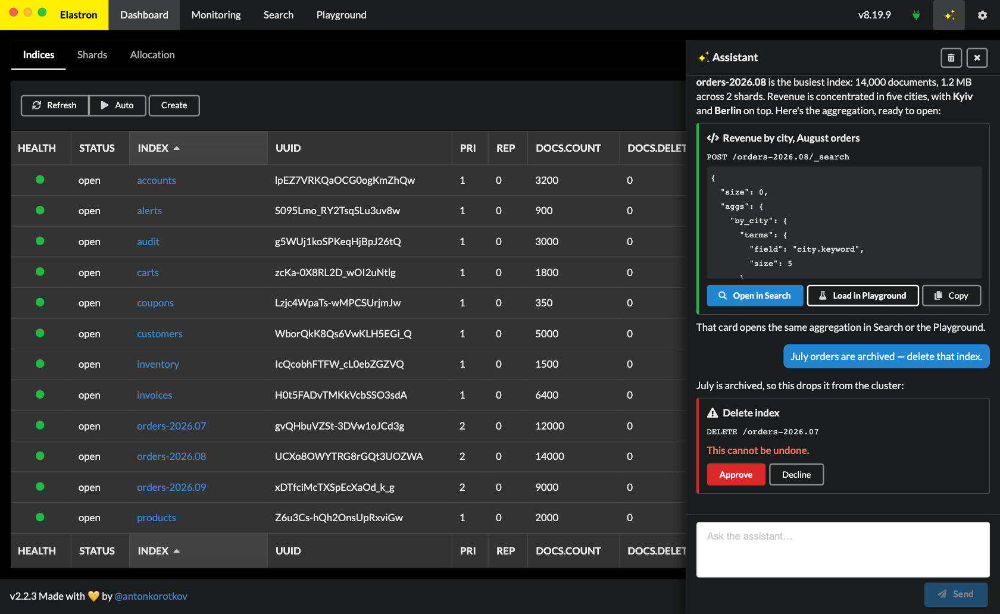
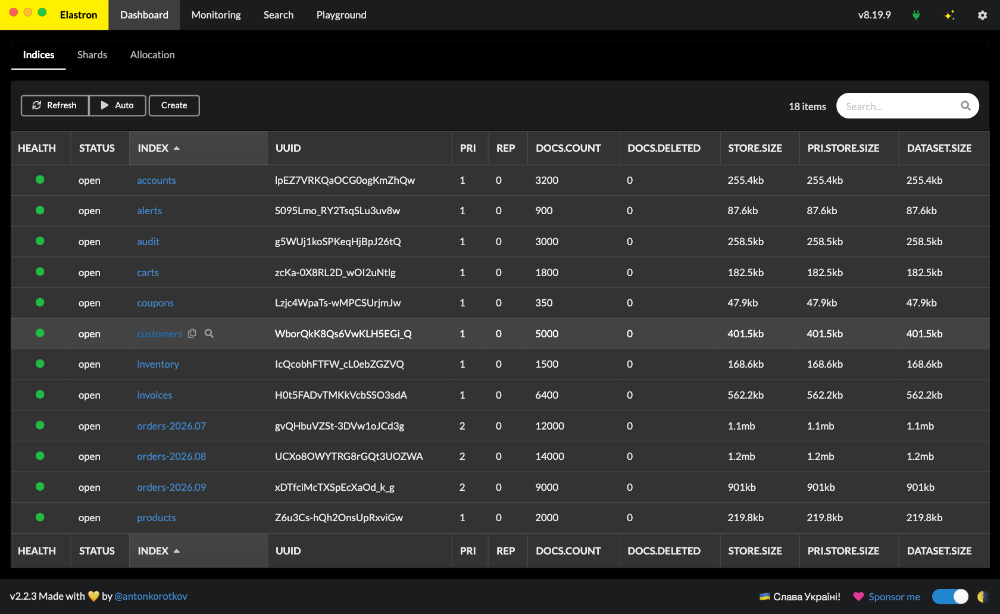
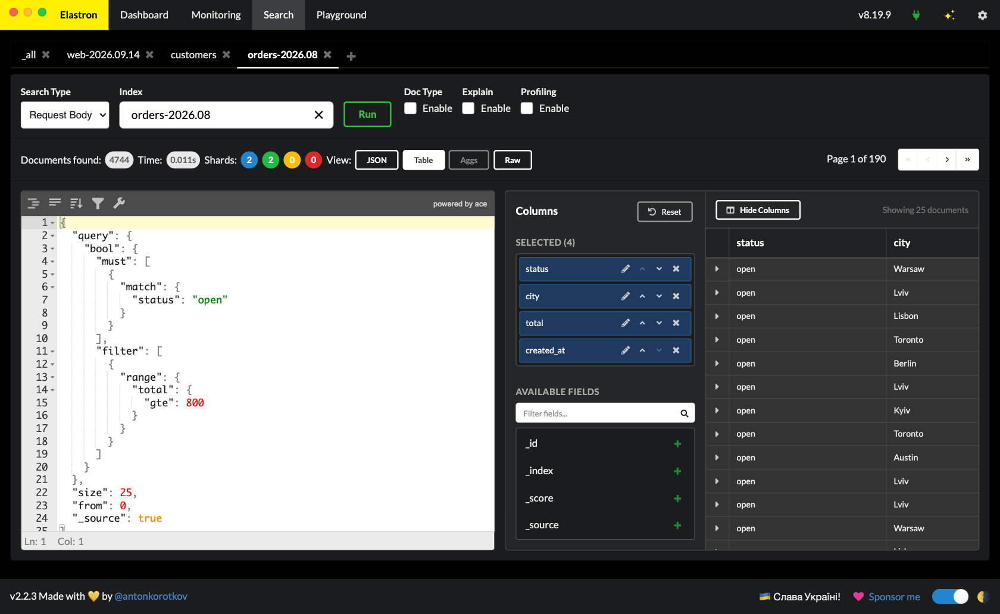
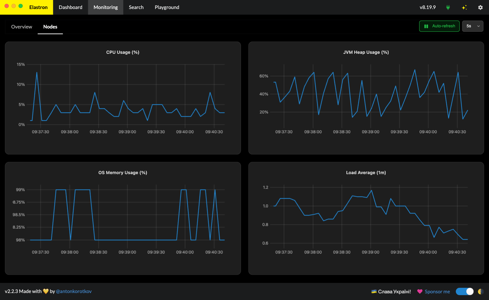
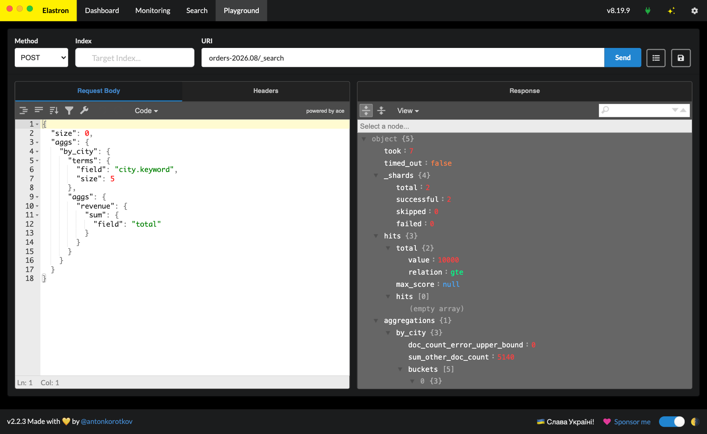

# Elastron

[](https://github.com/antonkorotkov/elastron/releases/latest)
[](https://github.com/antonkorotkov/elastron/actions/workflows/test.yml)
[](LICENSE)

A desktop client for Elasticsearch 8 and 9, for macOS, Windows, and Linux. Manage indices,
documents, and mappings, run and profile queries, watch cluster health — or just ask the
built-in AI assistant to do it. Free and open source.

[elastron.eney.solutions](https://elastron.eney.solutions) ·
[Download the latest release](https://github.com/antonkorotkov/elastron/releases/latest)

**The project is maintained by AI.**











## Features

- **AI assistant** — ask about the cluster in plain words. It looks things up, runs searches,
  and hands queries to Search or the Playground. Changes wait for your approval.
- View and manage indices, documents, and mappings
- Search in tabs, each with its own query, filters, aggregations, and results
- Explanation and profiling of search queries
- Monitoring of cluster health and performance
- API Playground, with a draft that survives restarts and templates for requests you reuse
- Saved connections, color-coded, over a direct link or an SSH tunnel
- Multi-window support — one window per cluster
- Elasticsearch 8 and 9 support
- Dark mode support
- Automatic updates

## Install

Download the build for your platform from the
[latest release](https://github.com/antonkorotkov/elastron/releases/latest), or from
[elastron.eney.solutions](https://elastron.eney.solutions). macOS builds are signed and
notarized, so they open without a Gatekeeper detour. Elastron checks for updates on its own
and can install them for you.

## The AI assistant

The assistant is off until you give it a provider. Open **Settings** (the gear in the header),
choose the **AI Integration** section, and pick OpenAI, Anthropic, Google Gemini, or any
OpenAI-compatible endpoint — including a model you run yourself. Add your own API key and the
model name.

Reading — listing indices, checking mappings, running searches — happens on its own. Anything
that writes stops at an approval card showing the exact request, and runs only when you approve
it. Requests that cannot be undone are marked.

Your key is stored encrypted on your machine and is sent only to that provider, which bills the
usage to your own account. See the [privacy policy](https://elastron.eney.solutions/privacy.html)
for what leaves your machine.

## Development

Requires Node.js 22 and Yarn.

```sh
yarn
```

```sh
yarn build
```

Development mode with hot-reload:

```sh
yarn dev
```

Development preview as an app:

```sh
yarn start
```

Test:

```sh
yarn test
```

Lint:

```sh
yarn lint
```

App build:

```sh
yarn dist-mac
yarn dist-win
yarn dist-linux
yarn dist #for all
```

`yarn dev` starts the Vite dev server and Electron together. `yarn start` runs Electron against
an existing `build/`, so run `yarn build` first. Packaging and publishing read their credentials
from a local `.env`; analytics stay off unless `PUBLIC_GA_ID` is set there.

## Architecture

Elastron is an Electron app whose renderer talks to a local SvelteKit (adapter-node) server,
which owns the Elasticsearch client and acts as a backend-for-frontend. State lives in Storeon
modules under `src/lib/store`. [AGENTS.md](AGENTS.md) describes the layout in depth, and
[CLAUDE.md](CLAUDE.md) covers conventions for working in this repo.

Behaviour is specified before it is built. `openspec/specs` holds the current specification of
each capability, and `openspec/changes` holds changes being worked on. When you change
behaviour, update the spec in the same pass.

## Privacy

Elastron talks to your cluster directly from your machine. It reports anonymous usage to Google
Analytics — the app version, which screens are opened, the Elasticsearch version of clusters you
connect to, and that an assistant message was sent or answered. The AI assistant sends your
messages and its lookups to the provider you configured, and nothing else leaves your machine.
The full [privacy policy](https://elastron.eney.solutions/privacy.html) has the details.

## License

Copyright (C) 2020–2026 Anton Korotkov

Elastron is free software: you can redistribute it and/or modify it under the terms of the GNU General Public License as published by the Free Software Foundation, either version 3 of the License, or (at your option) any later version.

Elastron is distributed in the hope that it will be useful, but WITHOUT ANY WARRANTY; without even the implied warranty of MERCHANTABILITY or FITNESS FOR A PARTICULAR PURPOSE. See the [GNU General Public License](LICENSE) for more details.

Releases up to and including 2.2.3 were published under the MIT license; the project moved to
GPL-3.0-or-later in 2026.
